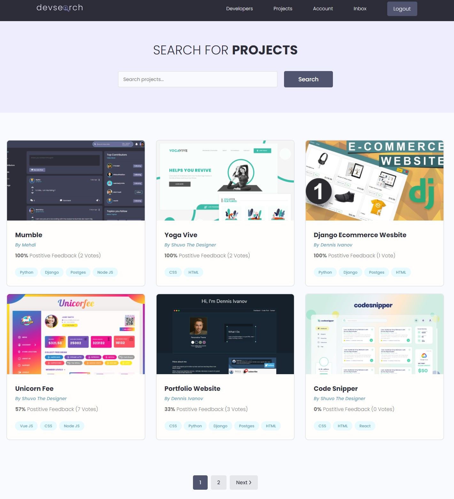
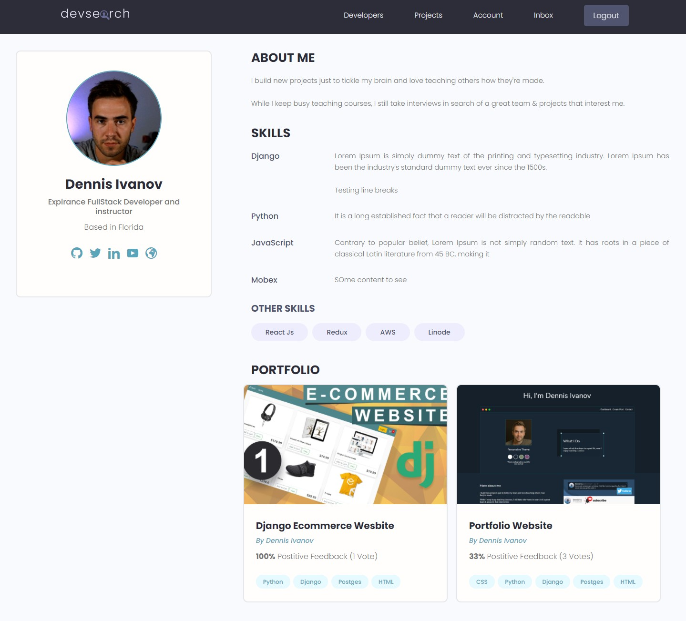
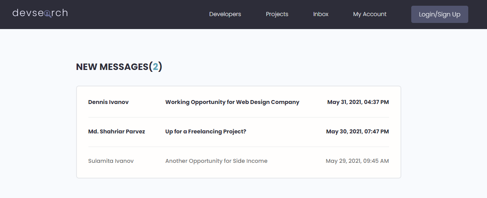

# DevVerse 

  DevVerse is a one-stop destination for developers to connect with customer.

  DevVerse gives the developers a platform to showcase, connect and offer their services to customer worldwide.

  Provides dedicated Profiles to developers, direct messaging system to the developers and help the customer to find
the appropriate person for the job with the help of an inbuilt search system that matches keywords with the appropriate developer.

  Currently, the website is being built using Python and Django Framework.

The most probable ScreenShots of the Website

# Developers Home Page

# Projects Home Page 

# Developers Profile

# Messaging Facility for direct communication

